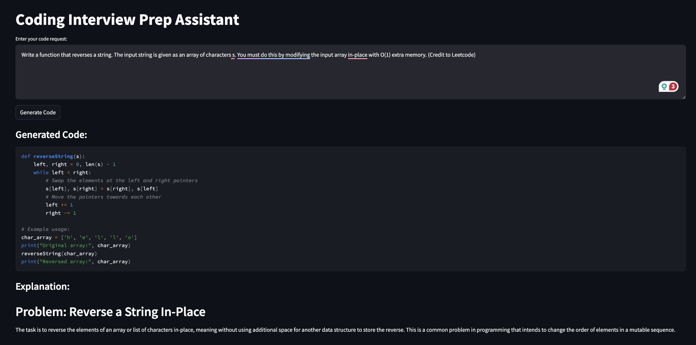
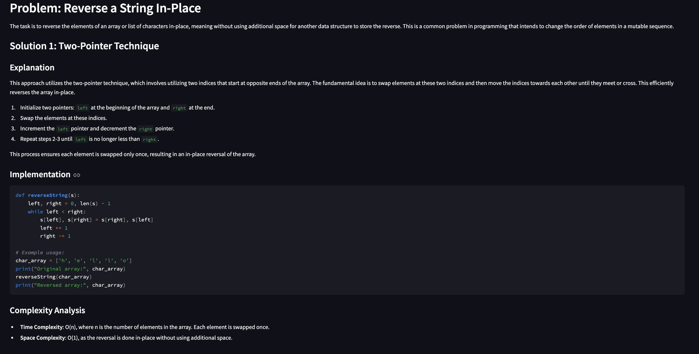
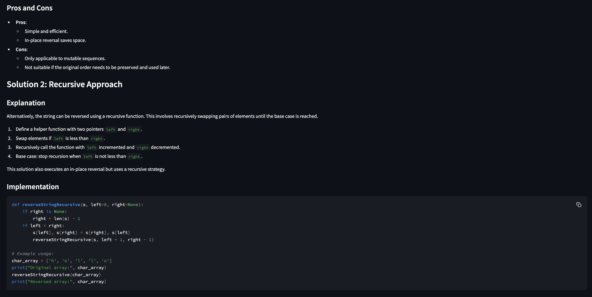
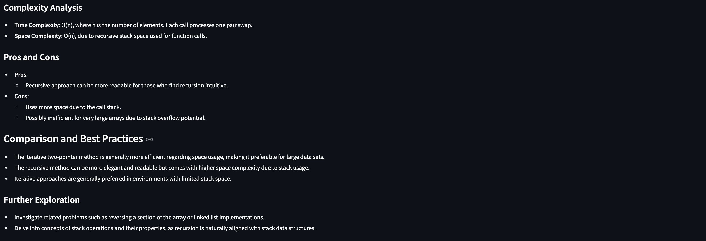

# Interview Prep Assistant

### Overview

Interview Prep Assistant is a small-scale app designed to help CS students practice for their coding interviews. It simulates the experience of working with a personal coding coach, providing solutions and explanations to help you prepare for coding interviews. When you submit a question, the service responds with a code solution and a detailed explanation. If you're looking for faster responses, you might want to consider using Groq instead of OpenAI.

Note: this is created for fun / test E2B's OpenAI Code Interpreter capabilities and is not affiliated with Groq or E2B or OpenAI.

### Features

- **User Input**: You can type your coding problems directly into the text area.
- **Code Generation**: When you click the "Generate Code" button, the app talks to a backend service to come up with a solution.
- **Code Display**: The code that's generated is shown in a way that's easy to read.
- **Explanations**: You'll get a detailed explanation of the code that's generated.
- **Error Handling**: If something goes wrong while generating the code, the app will let you know what's happening.

### Technologies

- **Frontend**: We use Streamlit to create the user interface. It's like the face of our application, where you can type in your coding problems.
- **Backend**: Our backend is powered by an Express.js server. It's like the brain of our application, where all the code generation magic happens.
- **API Communication**: We use HTTP requests to talk to our backend service. It's like the way our frontend and backend communicate with each other.

### Environment Setup

- **Environment Variables**: You will need to create a `.env` file in the root directory of the project. The file should contain the following environment variables:
  - `OPENAI_API_KEY`: Your OpenAI API key.
  - `E2B_API_KEY`: Your E2B API key.

### Requirements

1. Clone the repository:

   ```bash
   git clone <repository-url>
   cd <repository-directory>
   ```

2. Install the required packages:

   ```bash
   pip install streamlit requests
   ```

3. Start the backend server:
   Make sure the backend server (running on port 3001) is up and running. You can do this by navigating to the backend directory and running:

   ```bash
   npm install
   npm start
   ```

4. Run the Streamlit application:
   ```bash
   streamlit run streamlit.py
   ```

### Usage

1. Open your web browser and navigate to `http://localhost:8501` (default Streamlit port).
2. Enter your coding problem in the provided text area.
3. Click the "Generate Code" button to receive a solution.
4. Review the generated code and its explanation.

### Contribution

I'm excited to share this project with the community, but I won't be maintaining it. That said, I encourage you to make it your own by forking the project and adding your unique touch. My goal was to explore the capabilities of e2b's OpenAI Code Interpreter.

### Example

- **Input**: "Write a function that reverses a string. The input string is given as an array of characters s. You must do this by modifying the input array in-place with O(1) extra memory (credit to Leetcode)."
- **Output**: The application will display the generated Python code and a detailed explanation of the solution.

### License

This project is licensed under the MIT License - see the [LICENSE](LICENSE) file for details.





